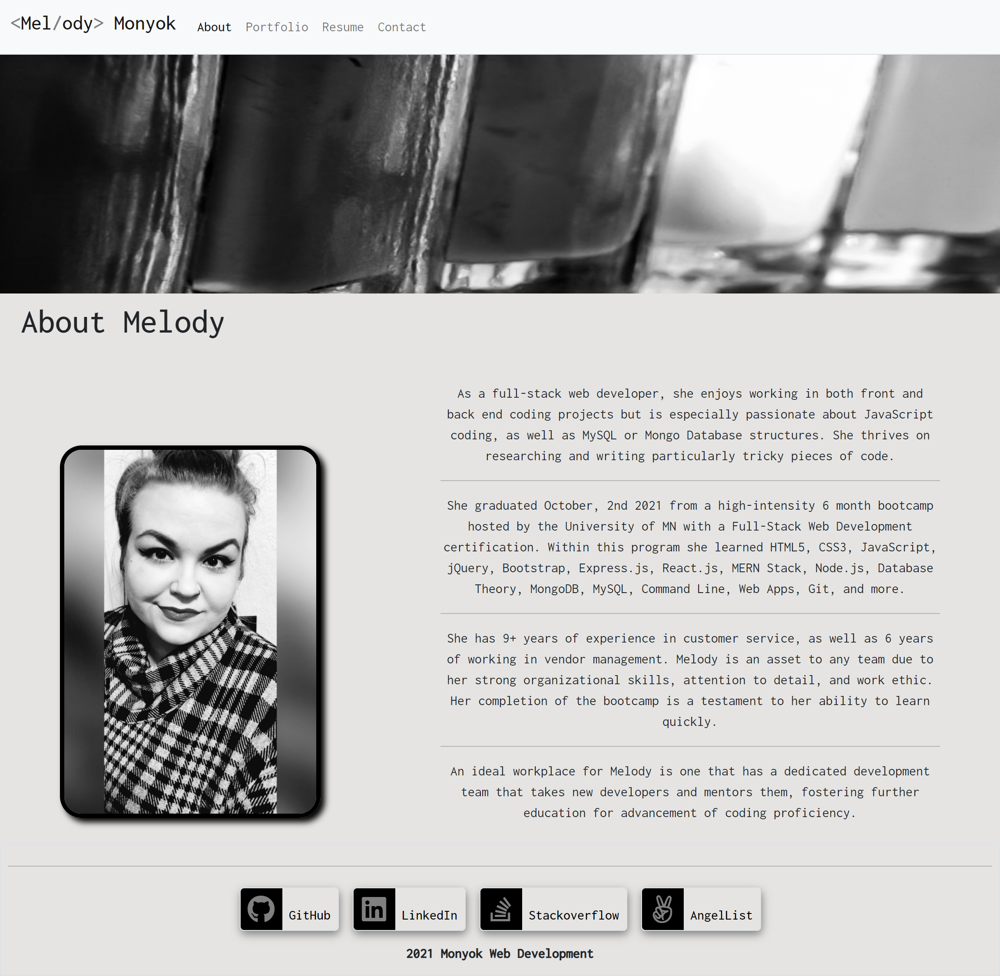

# reactPortfolio
A central location to show all of my coding accomplishments.

[Live site!](https://melodymonyok.herokuapp.com/)

 

## Description
- My old portfolio was very outdated, so I wanted to revamp it with my skills learned in React.
- The updated version is more complex, yet simple, and it is more visually pleasing.
- I learned a lot more about React while working on it, including React Router, sending emails through React, React styling, modals.

## Table of Contents
- [reactPortfolio](#reactportfolio)
  - [Description](#description)
  - [Table of Contents](#table-of-contents)
  - [Installation](#installation)
  - [Usage](#usage)
  - [Credits](#credits)
  - [License](#license)
  - [Contributing](#contributing)
  - [Tests](#tests)
  - [Contact](#contact)

## Installation
If you are interested in using my portfolio as a layout, please contact me first.

## Usage
My portfolio will allow you to view my top six projects, including collaborations, my resume, contact information, and a little bit about my coding journey.

## Credits
- Technologies Used:
  - [HTML](https://www.w3schools.com/html/)
  - [CSS](https://www.w3schools.com/css/)
  - [JavaScript](https://www.w3schools.com/js/)
  - [Bootstrap](https://getbootstrap.com/)
  - [FontAwesome](https://fontawesome.com/)
  - [Google Fonts](https://fonts.google.com/)
  - [The Following Node Packages:](https://www.npmjs.com/get-npm)
    - react
    - react-bootstrap
    - react-dom
    - react-router-dom
    - react-scripts
    - web-vitals
    - @testing-library/jest-dom
    - @testing-library/react
    - @testing-library/user-event
    - cors
    - dotenv
    - bootstrap
    - express
    - nodemailer

- Tutorials Followed:
[Professional README guide template provided by Coding Boot Camp.](https://github.com/coding-boot-camp)
[Implementing Email Functionality in Contact Form](https://dev.to/jlong4223/how-to-implement-email-functionality-with-node-js-react-js-nodemailer-and-oauth2-2h7m)

## License
MIT License

Copyright (c) [2021] [Melody Monyok]

Permission is hereby granted, free of charge, to any person obtaining a copy
of this software and associated documentation files (the "Software"), to deal
in the Software without restriction, including without limitation the rights
to use, copy, modify, merge, publish, distribute, sublicense, and/or sell
copies of the Software, and to permit persons to whom the Software is
furnished to do so, subject to the following conditions:

The above copyright notice and this permission notice shall be included in all
copies or substantial portions of the Software.

THE SOFTWARE IS PROVIDED "AS IS", WITHOUT WARRANTY OF ANY KIND, EXPRESS OR
IMPLIED, INCLUDING BUT NOT LIMITED TO THE WARRANTIES OF MERCHANTABILITY,
FITNESS FOR A PARTICULAR PURPOSE AND NONINFRINGEMENT. IN NO EVENT SHALL THE
AUTHORS OR COPYRIGHT HOLDERS BE LIABLE FOR ANY CLAIM, DAMAGES OR OTHER
LIABILITY, WHETHER IN AN ACTION OF CONTRACT, TORT OR OTHERWISE, ARISING FROM,
OUT OF OR IN CONNECTION WITH THE SOFTWARE OR THE USE OR OTHER DEALINGS IN THE
SOFTWARE.

## Contributing
- Please contact me with any contributions you think will improve this project.

## Tests
- No further testing is needed, unless any new contributions are made; the owner of this project will locally test any contribution submissions prior to approval.

## Contact
- Melody Monyok
  - <monyokwebdev@gmail.com>
  - (612) 492-1528